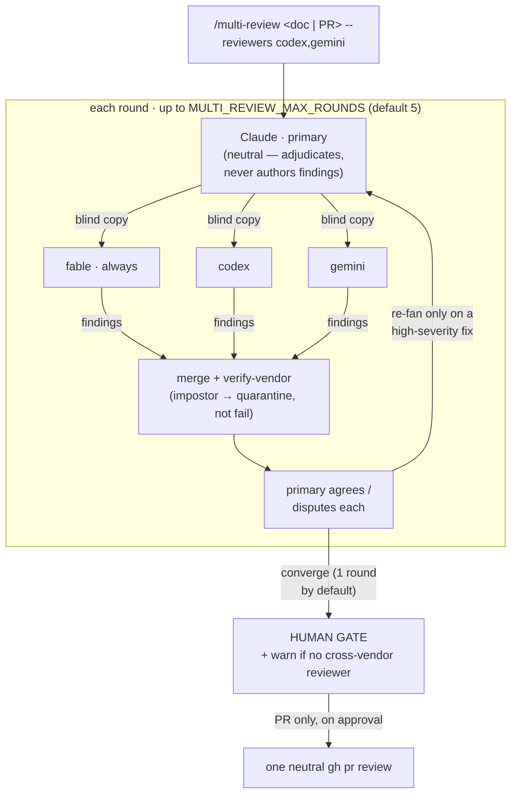

# multi-review

<p align="center">
  
  <br>
  <em>Primary, secondaries, human gate — everyone checks everyone.</em>
</p>

An **opt-in, human-gated** code/design review where Claude (the **primary**) fans a doc or PR out
to **N independent secondaries**, adjudicates their findings, and converges — always stopping at a
**human approval gate**. `fable` is always one secondary (Claude's guaranteed review voice); add
cross-vendor reviewers (`codex`, `gemini`) for independent perspective.

One command, one model — **star** — for both local design docs and GitHub PRs.



## Install

    /plugin install agrology/multi-review            # direct
    # or browse + get updates via the plugin UI:
    /plugin marketplace add agrology/multi-review
    /plugin install multi-review@agrology

Installs the `/multi-review` command + its scripts. The marketplace path also lists the plugin in
Claude Code's plugin UI with version tracking / update prompts. Reviewer setup depends on which
reviewers you add (below) — `fable` needs none.

**If your design docs live somewhere other than the defaults below,** set `MULTI_REVIEW_DOC_DIRS`
before the first run — the egress guard refuses to arm on a path outside it, so a repo with any
other layout is blocked until it is set:

```jsonc
// .claude/settings.json
{ "env": { "MULTI_REVIEW_DOC_DIRS": "docs/design docs/rfcs" } }
```

Space-separated; individual dirs cannot contain spaces.

**Migrating from the `dual-review` predecessor?** It used `DUAL_AGENT_DOC_DIRS`. That variable is
gone and nothing inherits it — if your `.claude/settings.json` set it, replace it with
`MULTI_REVIEW_DOC_DIRS`, or drop it entirely if your docs are under either default layout.

**Contributing to this repo?** Run `scripts/multi-review-install-hooks.sh` once per clone. It
points `core.hooksPath` at the versioned `.githooks/`, whose `pre-push` refuses a push that has
not raised `.claude-plugin/plugin.json`'s `version` — the comparison installed copies use to
decide whether to offer an update. `git push --no-verify` bypasses it for a WIP branch.

CI (`.github/workflows/gate.yml`) runs the full gate on every PR: the shell test suites on Linux
**and** macOS (the latter on `/bin/bash` 3.2, the version these scripts target), `shellcheck`, the
version-bump check, and a **mutation sweep** that deletes each security guard in turn and fails
unless a named test catches it — because a green suite is not by itself evidence that a guard bites.

## Use it

```bash
/multi-review docs/specs/2026-01-01-my-design.md        # local doc, fable only
/multi-review docs/specs/2026-01-01-my-design.md --reviewers codex   # + codex (cross-vendor)
/multi-review https://github.com/owner/repo/pull/42 --reviewers codex,gemini
```

- **You don't have to type the path.** Just say "multi-review the spec / the plan / this PR" —
  it resolves to the doc in context, or the newest dated doc under `MULTI_REVIEW_DOC_DIRS`.
- **Name reviewers in plain language.** "multi-review the spec with codex and gemini" is
  equivalent to `--reviewers codex,gemini`.
- **The combo is remembered per repo.** The last explicitly-named set is saved to
  `.multi-review/reviewers.pref`; a later bare run reuses it (self-healing — a reviewer that
  isn't set up is dropped for that run with a notice, not an error). Say "forget the reviewers"
  to reset to fable-only.
- PR refs also accept `owner/repo#n` and, in the current repo, `#n`.
- The set is always **`(--reviewers) ∪ {fable}`** — `fable` can't be removed.
- Local docs are found under `MULTI_REVIEW_DOC_DIRS` (default `docs/specs docs/plans docs/superpowers/specs docs/superpowers/plans` — both the plain and `superpowers` layouts); pass an
  explicit path otherwise.
- On a PR, `gh` ingests the diff into a gitignored scratch file; on approval the primary posts
  **one** neutral `gh pr review` (anchored findings inline, the rest in the summary). Needs `gh` +
  `jq`.

## Reviewers

| reviewer | vendor | setup |
|---|---|---|
| `fable` *(always on)* | anthropic | **none** — runs in-harness |
| `codex` | openai | `codex` CLI authed — skill provisioned automatically per run (git-ignored) |
| `gemini` | google | `gemini` CLI authed + 3 settings (below) |

**codex skill:** provisioned automatically. On each run `/multi-review` materializes
this repo's `.agents/skills/multi-review/` into the reviewed repo's root (git-ignored via
`.git/info/exclude` + an in-dir `.gitignore`); nothing to copy, nothing committed. A
`.agents/skills/multi-review/` you commit yourself is respected and left untouched (and
flagged as possibly drifting from the installed plugin). An **untracked** copy (e.g. a stale
manual copy from before auto-provisioning existed) is never touched either — auto-provisioning
refuses to run until you remove it, and `--check-reviewers`/`doctor` will flag that too.

**gemini prereqs** (in order — the first is *the* blocker):
1. **`export GEMINI_CLI_TRUST_WORKSPACE=true`** (or trust the folder once). An untrusted workspace
   makes the CLI skip `.env` (so it can't authenticate — the error misleadingly says "set an Auth
   method") *and* disables file edits, so the reviewer can't write the doc.
2. An API key — `export GEMINI_API_KEY=…`, or drop `GEMINI_API_KEY=…` in `~/.gemini/.env` (or your
   repo's `.env`). **It auto-loads once the workspace is trusted.**
3. `.gemini/settings.json` → `{"context":{"fileFiltering":{"respectGitIgnore":false}}}`. Needed
   whenever the docs gemini must read are gitignored — your doc dirs, or PR mode's
   `.multi-review/` scratch — which is the common case. `--check-reviewers` names the exact
   paths when this applies and stays silent when it does not, and `doctor` reports it separately
   from auth (a reviewer that authenticates but cannot read the doc is not "ready").
   The free tier's daily cap will exhaust a multi-round review.

Gemini does **not** need the protocol on disk: skill-less reviewers get the contract inlined in
their dispatch prompt, so it reaches them regardless of workspace root or ignore rules.

Run **`/multi-review --check-reviewers`** to verify every reviewer's setup at a glance.

## Config

| env | default | meaning |
|---|---|---|
| `MULTI_REVIEW_REVIEWERS` | *(empty)* | comma set of extra secondaries, e.g. `codex,gemini` (per-run: `--reviewers`) |
| `MULTI_REVIEW_MAX_ROUNDS` | `5` | round **ceiling** (each round costs N dispatches; convergence is adaptive) |
| `MULTI_REVIEW_REVIEWER_MODEL` | *(provider default)* | pin a provider's model (`codex`→`gpt-5.6-terra`, `fable`→`fable`, `gemini`→`gemini-pro-latest`) |
| `MULTI_REVIEW_DOC_DIRS` | `docs/specs docs/plans docs/superpowers/specs docs/superpowers/plans` | where bare-name local docs are resolved. Covers the plain and `superpowers` layouts out of the box. Bare-name resolution **warns** when a newer dated doc sits in a directory it did not search — the egress guard cannot catch that, since the doc it picked is legitimately inside the configured dirs. |
| `MULTI_REVIEW_GEMINI_AUTOTRUST` | *(off)* | `=1` scopes `GEMINI_CLI_TRUST_WORKSPACE=true` to the gemini dispatch (no profile edit needed). **Security:** trusting a workspace lets gemini honor its `.env`/settings and auto-edit — enable only for repos you trust, never a freshly-cloned one. |

The last explicitly-named reviewer combo is remembered per repo in **`.multi-review/reviewers.pref`**
(gitignored). It is written when reviewers are named (flag or prose) — **except** when
`MULTI_REVIEW_REVIEWERS` is set, which would shadow the pref anyway, so the write is skipped with a
notice. It sits **below** `MULTI_REVIEW_REVIEWERS` in precedence, and self-heals — a remembered
reviewer that isn't available in the repo is dropped on read (with a notice), never poisoning the
run. Reset it with a "forget the reviewers" request.

## How it works

- **Neutral primary.** Claude only agrees/disputes secondaries' findings — it never authors its
  own. That's the anti-rubber-stamp property. `fable` is the always-present secondary so Claude's
  *review* voice is still heard, but adjudicated like any other.
- **Blind, independent copies.** Each secondary reviews its own copy and never sees the others —
  uncorrelated perspective, not consensus.
- **Identity-checked.** After each turn, `verify-vendor` confirms the finding's `> — via`
  disclosure maps to the selected provider's **vendor**. A mismatch or a no-show → that secondary
  is **quarantined** (set aside, surfaced), and the round proceeds on the rest.
- **Adaptive rounds.** The primary re-fans-out while a round still surfaces new findings, up to
  `MAX`; it converges the moment a round goes dry. Convergence is **coverage** — every finding has
  an agree/dispute — not agreement.
- **Independence, honestly.** The gate warns when no *cross-vendor* secondary was admitted (a
  `fable`-only run shares Claude's lineage — real value, weaker claim). Silence = a cross-vendor
  perspective was present.
- **Human gate.** Nothing auto-merges or auto-posts; the run stops for you to decide.

> **`> — via` lines are self-claims, and models misreport their own identity** (a
> `gemini-3.1-pro` turn has disclosed itself as `gemini-2.5-pro`). That's why `verify-vendor`
> checks the **vendor**, not the exact id — treat the line as *who answered*, not a version.

## Layout

- `commands/multi-review.md` — the `/multi-review` command
- `docs/multi-review.md` — the star protocol contract (also vendored into the reviewer skill)
- `.agents/skills/multi-review/` — the self-contained reviewer skill, auto-provisioned into consumer repos for `codex` (git-ignored)
- `.claude-plugin/plugin.json` — plugin manifest
- `scripts/multi-review-star.sh` — star grammar: mode / resolve-set / merge / open-findings / check-converged / gate-summary / channel-check / compose
- `scripts/multi-review-reviewer.sh` — provider registry: resolve / check / prompt / command / ensure-skill / doctor / verify-vendor / vendor-of-model
- `scripts/multi-review-pr.sh` — PR ingest (via `gh`) + the one-neutral-review publish
- `scripts/multi-review-scope.sh` — diff-scoped copies for round N≥2 (local docs): body reduction, fence-aware region mapping, `local-copy`
- `scripts/multi-review-core.sh` — marker state; `-wait.sh` — bounded per-copy wait;
  `-egress-guard.sh` — path validation; `-build-reviewer-bundle.sh` — regenerate the skill bundle;
  `-history-check.sh` — pre-publish sensitive-term gate (see `PUBLISHING.md`)
- `scripts/*.test.sh` — one suite per script (the gate below)
- `CLAUDE.md` / `AGENTS.md` — this repo's engineering agreement (§11 = multi-review specifics)

## Tests

    for t in scripts/*.test.sh; do bash "$t" || exit 1; done

Runs on macOS `/bin/bash` 3.2 and modern bash; keep `shellcheck --severity=warning scripts/multi-review-*.sh` clean.
